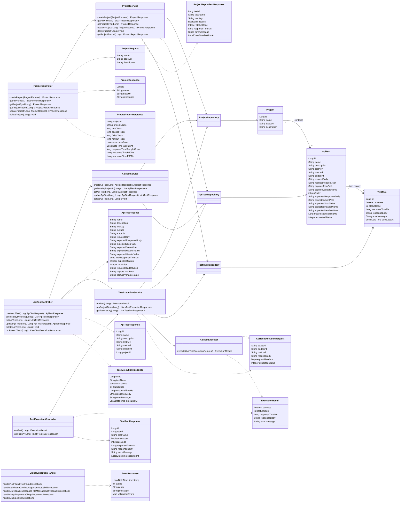

# Class Diagram

## Main Structure

- `Project`является корневой сущностью системы. Она хранит базовый URL тестируемого API.
- `ApiTest` принадлежит определённому проекту и описывает одну проверку API: HTTP-метод, endpoint, ожидаемый статус ответа, проверки содержимого ответа, заголовки, ограничение времени ответа, порядок выполнения и возможность сохранения переменных.
- `TestRun` представляет собой сохранённый результат выполнения API-теста.
Контроллеры предоставляют REST endpoint’ы и передают выполнение бизнес-логики сервисному слою.
Сервисы содержат основную бизнес-логику приложения: CRUD-операции, пакетный запуск тестов, хранение истории выполнения и формирование отчётов по проекту.
Репозитории изолируют работу с базой данных с использованием Spring Data JPA.
DTO и model-классы разделяют данные HTTP-запросов и ответов от JPA-сущностей.
- `ApiTestExecutor` выполняет исходящий HTTP-запрос к тестируемому API и возвращает результат выполнения в виде объекта ExecutionResult.
- `GlobalExceptionHandler` обеспечивает централизованную обработку исключений и преобразует ошибки в единообразные HTTP-ответы API.